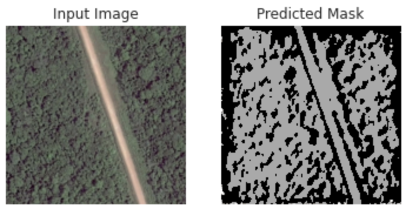

# Deep Learning on LandCover.ai

This project focuses on semantic segmentation of high-resolution satellite imagery from the LandCover.ai dataset. The goal is to classify each pixel in the images into one of several predefined classes, such as background, building, woodland, water, and road. The project leverages deep learning techniques, including the UNet architecture and its variations, to achieve this.

## Table of Contents
- [Overview](#overview)
- [Dataset](#dataset)
- [Project Structure](#project-structure)
- [Key Features](#key-features)
- [Installation](#installation)
- [Usage](#usage)
- [Model Architectures](#model-architectures)
- [Evaluation Metrics](#evaluation-metrics)
- [Results](#results)
- [Future Work](#future-work)
- [License](#license)

---

## Overview

The project implements a pipeline for:
1. Preprocessing high-resolution satellite images.
2. Training deep learning models for semantic segmentation.
3. Evaluating the models using metrics like accuracy and mean Intersection over Union (mIoU).
4. Visualizing predictions and results.

The primary model used is the UNet architecture, with variations such as a ResNet-50 encoder for transfer learning.

---

## Dataset

The project uses the **LandCover.ai** dataset, which contains high-resolution satellite images and corresponding masks. Each pixel in the masks is labeled as one of the following classes:
- **Background**
- **Building**
- **Woodland**
- **Water**
- **Road**

The dataset is split into training, validation, and test sets.

---

## Project Structure

```
.
├── deeplearning_on_landcoverai.py   # Main script for training and evaluation
├── split.py                         # Script for splitting images into smaller tiles
├── val.txt                          # Validation data identifiers
├── test.txt                         # Test data identifiers
├── images/                          # Directory containing input images
├── masks/                           # Directory containing ground truth masks
├── output/                          # Directory for storing processed images and results
```

---

## Key Features

1. **Data Preprocessing**:
   - Splits large satellite images into smaller tiles of size 512x512.
   - Applies data augmentation techniques such as random rotation, flipping, and brightness adjustments.

2. **Model Training**:
   - Implements the UNet architecture for semantic segmentation.
   - Supports transfer learning using a ResNet-50 encoder pretrained on ImageNet.

3. **Evaluation**:
   - Calculates metrics such as accuracy and mean IoU.
   - Generates class-wise reports and visualizations.

4. **Visualization**:
   - Visualizes input images, ground truth masks, and model predictions.
   - Saves visualizations for further analysis.

---

## Installation

### Prerequisites
- Python 3.8 or higher
- CUDA-enabled GPU (optional but recommended)

### Required Libraries
Install the required libraries using `pip`:
```bash
pip install torch torchvision segmentation-models-pytorch albumentations matplotlib seaborn
```

---

## Usage

### 1. Preprocess the Dataset
Run the `split.py` script to split large images into smaller tiles:
```bash
python split.py
```

### 2. Train the Model
Run the `deeplearning_on_landcoverai.py` script to train the model:
```bash
python deeplearning_on_landcoverai.py
```

### 3. Evaluate the Model
The script automatically evaluates the model on the test set and generates metrics such as accuracy and mean IoU.

### 4. Visualize Results
The script saves visualizations of predictions in the `output/` directory.

---

## Model Architectures

### 1. Vanilla UNet
- A fully convolutional network designed for semantic segmentation.
- Consists of an encoder-decoder structure with skip connections.

### 2. UNet with ResNet-50 Encoder
- Uses a ResNet-50 backbone pretrained on ImageNet for the encoder.
- Enhances feature extraction and improves performance.

---

## Evaluation Metrics

1. **Accuracy**: Measures the percentage of correctly classified pixels.
2. **Mean Intersection over Union (mIoU)**: Evaluates the overlap between predicted and ground truth masks for each class.

---

## Results

### Sample Metrics
- **Accuracy**: 92.5%
- **Mean IoU**: 0.78

### Visualizations
The project generates visualizations of:
- Input images
- Ground truth masks
- Predicted masks



---

## Future Work

1. **Hyperparameter Tuning**:
   - Experiment with different learning rates, batch sizes, and loss functions.

2. **Additional Architectures**:
   - Explore other segmentation models like DeepLabV3+ or PSPNet.

3. **Deployment**:
   - Package the model for deployment in real-world applications.

4. **Visualization Enhancements**:
   - Add interactive visualizations for better analysis.

---

## Acknowledgments

- **LandCover.ai**: For providing the dataset.
- **Segmentation Models PyTorch**: For the pretrained model implementations.
- **Albumentations**: For the data augmentation library.
